+++

title =  "Kict It Up!"

 [[gallery_item]]
 album = "screenshots"
 image = "1.png"
 
 [[gallery_item]]
 album = "screenshots"
 image = "2.png"
 
 [[gallery_item]]
 album = "screenshots"
 image = "3.png"
 
 [[gallery_item]]
 album = "screenshots"
 image = "4.png"
 
 [[gallery_item]]
 album = "screenshots"
 image = "5.png"
 [[gallery_item]]
 album = "screenshots"
 image = "6.png"
+++

# Assignment 01


```python
%matplotlib inline
```


```python
import matplotlib.pyplot as plt
import numpy as np
import pandas as pd

from Data import Data
from LinearModel import LinearModel
```

Create 20 data points with a 10/10 train/test split.
<br>
X values are uniform in the interval [0,1]
<br>
See [Data.py](Data.py) for Y values and noise generation.


```python
data = Data(20)
```

Generate and train 10 models, 1 for each degree from [0,9]
<br>
Model weights are calculated using scikit-learn. See [LinearModel.py](LinearModel.py)


```python
models = [LinearModel(x) for x in range(10)]
for model in models:
    model.train(data)
```

Print the weights for models with degrees ${0, 1, 6, 9}$


```python
orders = [0, 1, 6, 9]
weights = pd.DataFrame()
for order in orders:
    temp = pd.DataFrame({f'M={order}': models[order].weights})
    weights = pd.concat([weights, temp], axis=1)
weights.round(2).fillna('')
```


<div>
<style scoped>
    .dataframe tbody tr th:only-of-type {
        vertical-align: middle;
    }

    .dataframe tbody tr th {
        vertical-align: top;
    }

    .dataframe thead th {
        text-align: right;
    }
</style>
<table border="1" class="dataframe">
  <thead>
    <tr style="text-align: right;">
      <th></th>
      <th>M=0</th>
      <th>M=1</th>
      <th>M=6</th>
      <th>M=9</th>
    </tr>
  </thead>
  <tbody>
    <tr>
      <th>0</th>
      <td>-0.08</td>
      <td>0.85</td>
      <td>0.2</td>
      <td>-21.35</td>
    </tr>
    <tr>
      <th>1</th>
      <td></td>
      <td>-1.77</td>
      <td>1.76</td>
      <td>836.67</td>
    </tr>
    <tr>
      <th>2</th>
      <td></td>
      <td></td>
      <td>35.75</td>
      <td>-11462.22</td>
    </tr>
    <tr>
      <th>3</th>
      <td></td>
      <td></td>
      <td>-189.77</td>
      <td>79390.64</td>
    </tr>
    <tr>
      <th>4</th>
      <td></td>
      <td></td>
      <td>307.81</td>
      <td>-316240.32</td>
    </tr>
    <tr>
      <th>5</th>
      <td></td>
      <td></td>
      <td>-206.74</td>
      <td>767371.03</td>
    </tr>
    <tr>
      <th>6</th>
      <td></td>
      <td></td>
      <td>50.81</td>
      <td>-1152319.24</td>
    </tr>
    <tr>
      <th>7</th>
      <td></td>
      <td></td>
      <td></td>
      <td>1044752.19</td>
    </tr>
    <tr>
      <th>8</th>
      <td></td>
      <td></td>
      <td></td>
      <td>-523597.76</td>
    </tr>
    <tr>
      <th>9</th>
      <td></td>
      <td></td>
      <td></td>
      <td>111290.17</td>
    </tr>
  </tbody>
</table>
</div>


Plot models with degrees ${0, 1, 3, 9}$


```python
fig, ax = plt.subplots(2, 2)
for i, order in enumerate(orders):
    models[order].plot(ax[i // 2][ i % 2], data)
plt.show()
```


    
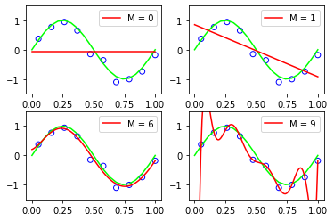
    


Notice the plot for $M = 9$ being overfit.

Plot the RMS error for each model


```python
train_errors = []
test_errors = []
degrees = list(range(len(models)))
for model in models:
    train_errors.append(model.error(data.X_train, data.Y_train))
    test_errors.append(model.error(data.X_test, data.Y_test))
fig = plt.figure()
ax = fig.add_subplot(1, 1, 1)
ax.plot(degrees, train_errors, color='blue', marker='o', markerfacecolor='none', label='Training')
ax.plot(degrees, test_errors, color='red', marker='o', markerfacecolor='none', label='Test')
ax.set_ylabel('ERMS')
ax.set_xlabel('M')
ax.legend(loc=2, prop={'size': 15}, frameon=True)
plt.show()
```


    
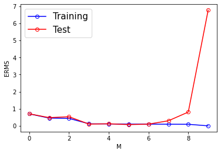
    


Generate 100 new data points and fit 9th degree model using 100 train data points.


```python
data_big = Data(100)
model9 = LinearModel(9)
model9.train(data_big)
fig, ax = plt.subplots()
model9.plot(ax, data_big)
plt.title('N = 100')
plt.show()
```


    
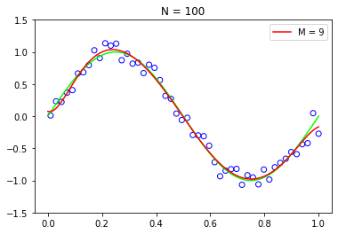
    


Notice that this model does not seem overfit.

Train 6 new models using regularization with $λ \in {1, 1/10, 1/100, 1/1000, 1/10000, 1/100000}$


```python
hyper_parameters = list(10 ** -x for x in range(6))
models = [LinearModel(9, hp) for hp in hyper_parameters]
for model in models:
    model.train(data)
```


```python
for i, hp in enumerate(hyper_parameters):
    fig, ax = plt.subplots()
    models[i].plot(ax, data)
    plt.title(f'λ = 1/{1/hp:.0f}')
    plt.show()
```


    
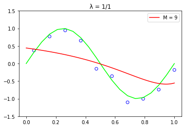
    


    
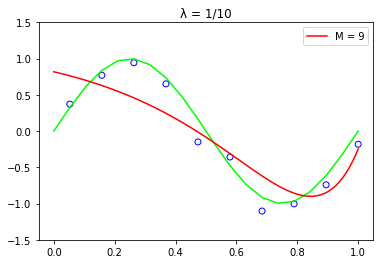
    


    
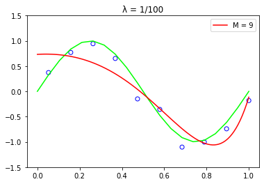
    


    
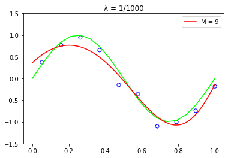
    


    
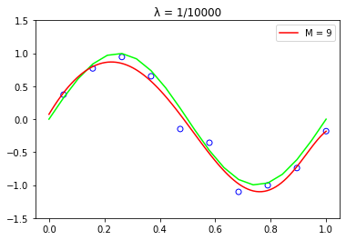
    


    
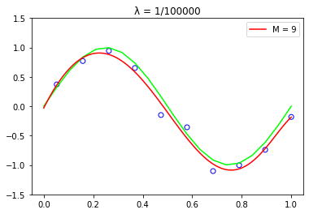
    


Train some new models using hyper parameters such that $ln(λ) \in [-30, -4]$


```python
hyper_parameters = np.arange(-30,-4)
models = [LinearModel(9, np.exp(hp)) for hp in hyper_parameters]
for model in models:
    model.train(data)
```

Plot train and test error for these new models.


```python
train_errors = []
test_errors = []
for model in models:
    train_errors.append(model.error(data.X_train, data.Y_train))
    test_errors.append(model.error(data.X_test, data.Y_test))
fig = plt.figure()
ax = fig.add_subplot(1, 1, 1)
ax.plot(hyper_parameters, train_errors, color='blue', label='Training')
ax.plot(hyper_parameters, test_errors, color='red', label='Test')
ax.set_ylabel('Erms')
ax.set_xlabel('ln λ')
ax.legend(loc=1, prop={'size': 15}, frameon=True)
plt.show()
```


    
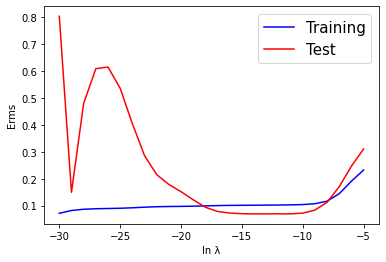
    


Find the model with lowest test error.


```python
min_index = np.argmin(test_errors)
best_model = models[min_index]
with np.printoptions(precision=3, suppress=True):
    print(f'Based on the test performance, the best model with degree 9 is ln λ = {np.log(best_model.hyper_parameter)}')
    print(f'Weights: {best_model.weights}')
```

    Based on the test performance, the best model with degree 9 is ln λ = -14.0
    Weights: [ -0.013   7.786 -13.365 -18.013  18.685  17.206  -0.476 -10.434  -7.289
       5.731]


Plot the best model found above.


```python
fig, ax = plt.subplots()
best_model.plot(ax, data)
plt.title('Best Model')
plt.show()
```


    
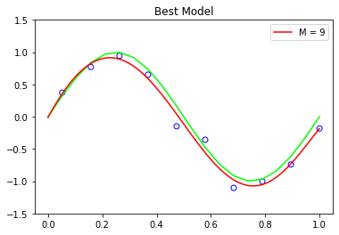
    


```python

```
